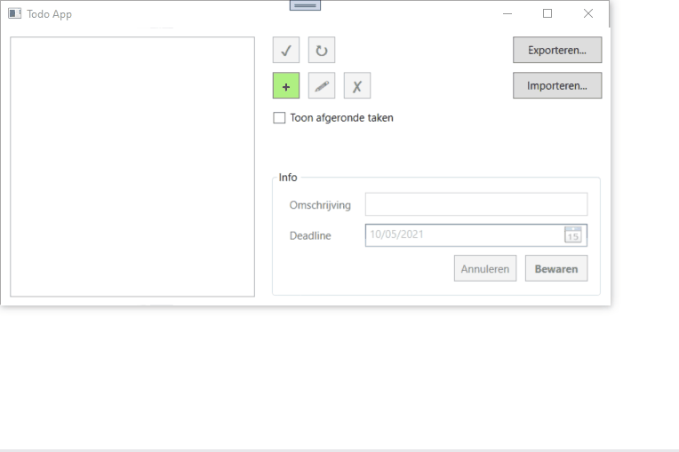

<div id="top"></div>


<!-- PROJECT LOGO -->
<br />
<div>
<h3>Todo app</h3>
  <p>
    A WPF app built with C#.
    <br>
    Data is stored in a SQL database.
    <br>
    Ability to export and import csv files.
  </p>
</div>



<!-- GETTING STARTED -->
## Getting Started

**Requirements:**
- [SQL Server Express](https://www.microsoft.com/nl-be/sql-server/sql-server-downloads?raw=true) 
- [SQL Server Management Studio](https://learn.microsoft.com/en-us/sql/ssms/download-sql-server-management-studio-ssms?view=sql-server-ver16?raw=true)

1. Clone the repository 
 ```sh
   git clone https://github.com/Nicolas-V93/Todo-App.git
   ```
2. Execute todoapp.sql (located in files directory) in SSMS. This will create an empty database.
3. In Todo.Core, go to the services directory and helper.cs. Change the connectionstring according to your SQL server settings.
5. Run WPF App

<p align="right">(<a href="#top">back to top</a>)</p>
